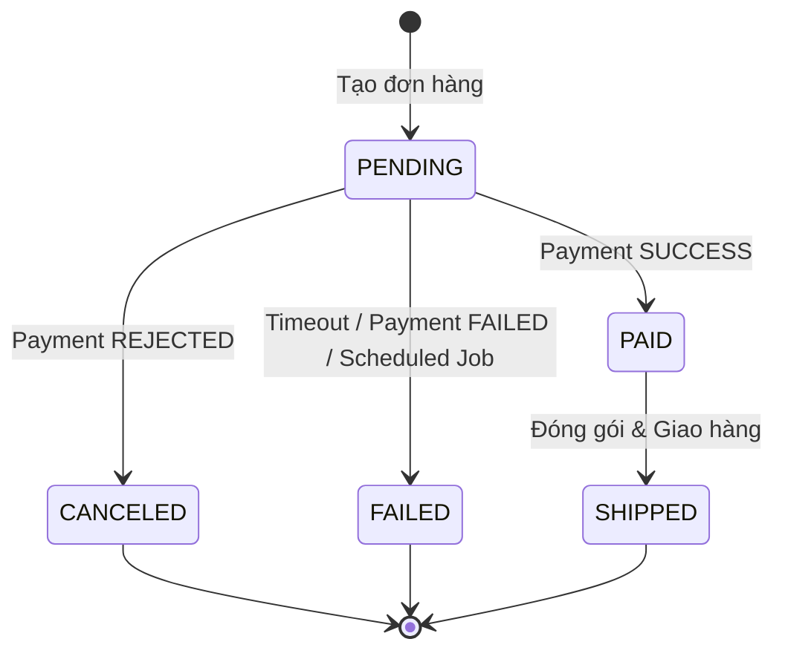

# Đồng bộ trạng thái đơn hàng lạc lối

## 1. Sơ đồ chuyển trạng thái (State Machine)

Dưới đây là sơ đồ Mermaid mô tả các trạng thái của đơn hàng và điều kiện chuyển đổi:

### Giải thích điều kiện chuyển đổi:
- **PENDING**: Trạng thái ban đầu khi khách hàng vừa đặt hàng thành công nhưng chưa hoàn tất thanh toán hoặc chưa nhận được phản hồi.
- **PAID**: Nhận được sự kiện `SUCCESS` từ Payment Service.
- **CANCELED**: Nhận được sự kiện `REJECTED` từ Payment Service.
- **FAILED**: Nhận được sự kiện `FAILED` hoặc quá thời gian chờ (Timeout/Scheduled Job quét các đơn `PENDING` quá 5 phút mà không có phản hồi).
- **SHIPPED**: Đơn hàng đã thanh toán (`PAID`) và chuyển sang giai đoạn vận chuyển.

## 2. Giải pháp kỹ thuật xử lý timeout
Để giải quyết vấn đề đơn hàng bị lạc lối (PENDING vĩnh viễn do mất kết nối mạng), hệ thống kết hợp 2 cơ chế:
1. **Event Listener (Real-time)**: Xử lý phản hồi ngay khi nhận được message từ message broker (Kafka/RabbitMQ).
2. **Scheduled Job (Cron/FixedRate)**: Định kỳ quét các đơn hàng ở trạng thái `PENDING` có thời điểm tạo cách hiện tại quá 5 phút và tự động chuyển sang trạng thái `FAILED` (hoặc gọi API sang Payment Service để vấn tin trạng thái trước khi quyết định).